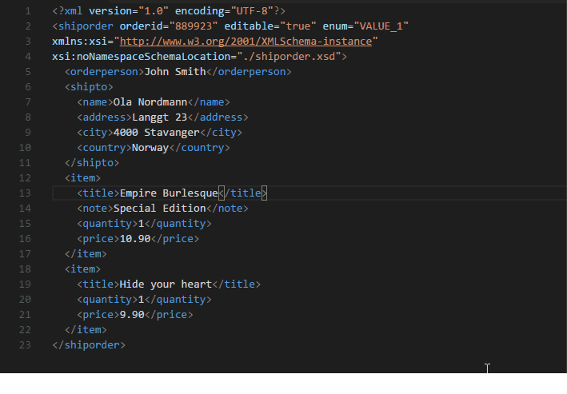

# Apps XML Language Server Support for Visual Studio 

This extension provides XSD-based schema intellisense for XML in [Visual Studio Code](https://code.visualstudio.com).

## Features

- Error messages for not well-formed XML documents
- Auto-completion for declaration name and attribute names and values

- Go To Definition of XSD Symbols
- Go To Definition os specific Apps Symbols

> Warning: Currently, this extension is only compatible with Windows. As soom as .NET Core XML Library got release we will update it to run on any plataform that runs the .Net Core 2.0

## Requirements

.NET Core Framework
.NET Framework (4.6.1)

## Extension Settings

Currently there are no settings available

## Issues

Run into a bug? Report it [here](https://github.com/springdevops/vscode-apps-language-server-xml/issues).

## Release Notes

Users appreciate release notes as you update your extension.

### 0.1.0

Initial release of the XML Language Server
